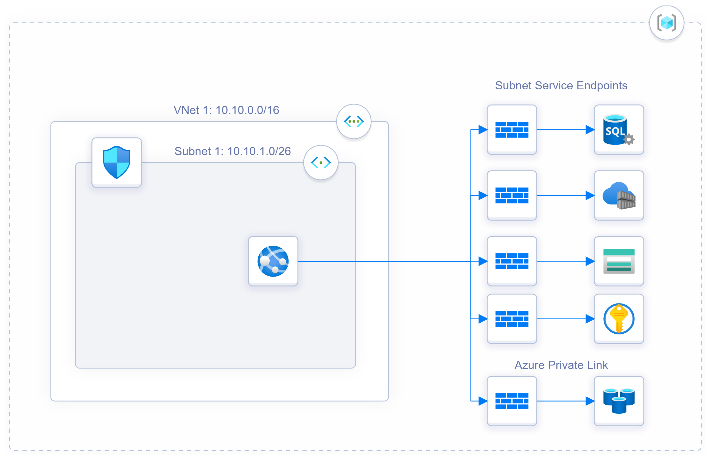

# Azure Secure App Service - Terraform Module

This Terraform module can be used to deploy the infrastructure presented on the diagram below, for this module to work you will need to setup some **environment variables** that will be listed and explained on this README.

